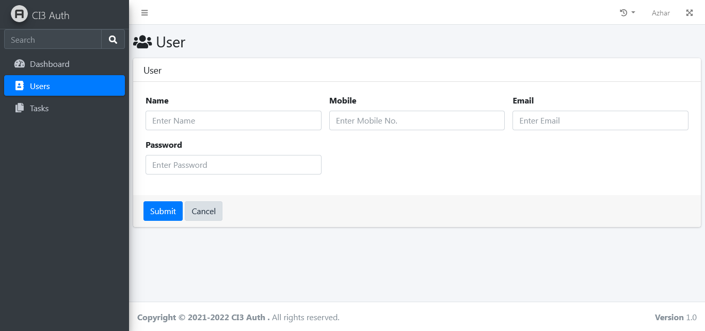

# CodeIgniter 3 Authentication 
CodeIgniter 3 Authentication with AdminLTE 3 (Codeigniter 3 Admin Template)


Blank Starter page is provided in views
dashboard/blank

## Screenshots
Login


Dashboard


Users


Add New User


Update User


Add New Task


Update Task


Profile


Change Password


Forgot Password


## Database
Database is available in database directory
```sql
ci3auth.sql
```


## Login Credentials
For Admin
1. Email :admin@ci3auth.com, Password:admin

For User
2. Email :user@ci3auth.com, Password:12345


## Installations 

Codeigniter 3 ["Installation Instructions"](https://codeigniter.com/userguide3/installation/index.html).

Adminlte 3 ["Installation"](https://adminlte.io/docs/3.0/).

## Author
Azhar Chaudhari
